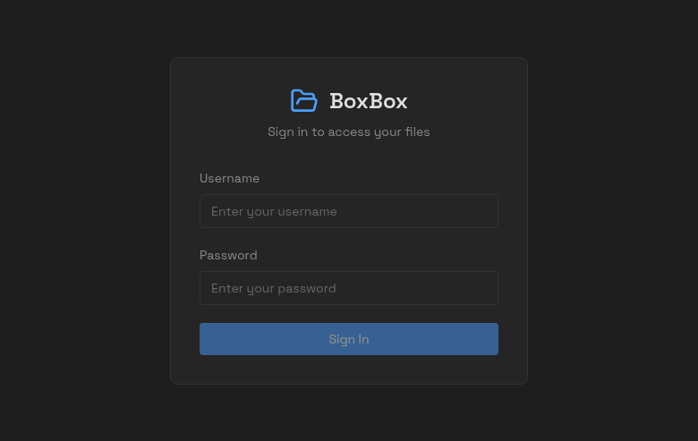
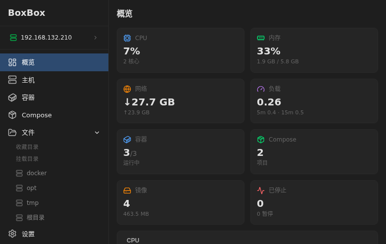
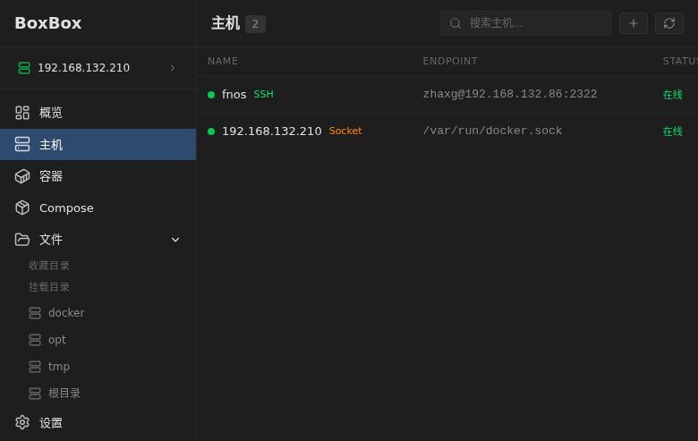
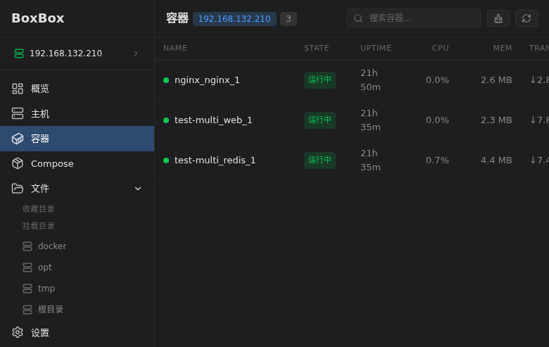
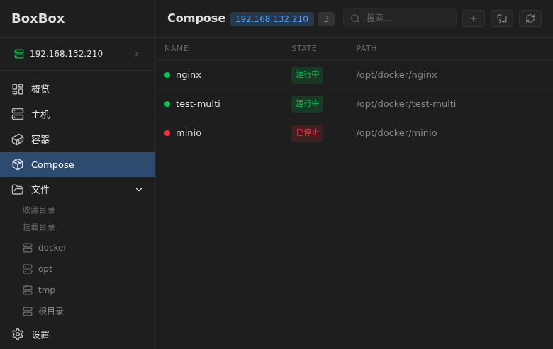
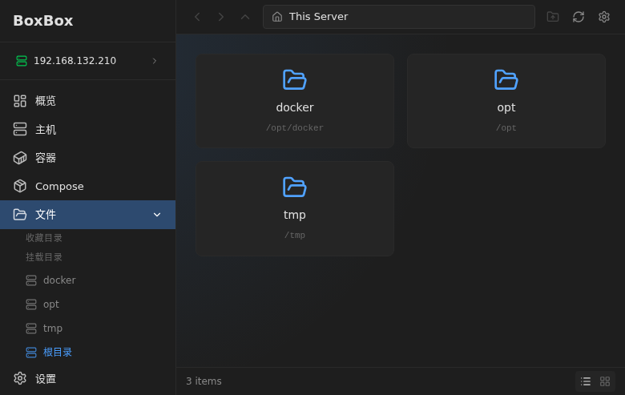
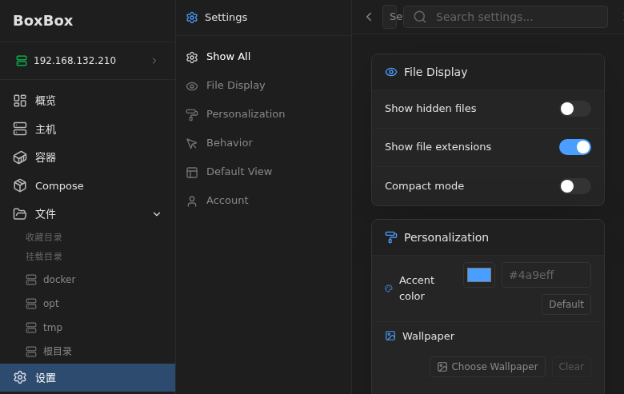

  
<h1 align="center">BoxBox</h1>

<p align="center">
  <strong>A modern, self-hosted file manager for your homelab</strong>
</p>

<p align="center">
  
  
  
  
  
</p>


BoxBox is a self-hosted file manager and Docker management platform for homelab and NAS-style servers. It provides a modern browser UI for managing multiple remote hosts, Docker containers, Compose projects, and file operations across mounted Linux paths.

### Why BoxBox?

- 🖥️ **Multi-Host Management** — Manage multiple Docker hosts from a single interface via SSH or socket
- 🐳 **Docker Control** — Start, stop, restart containers and manage Compose projects
- 📁 **File Browser** — Browse, upload, download, and preview files with drag-and-drop support
- 🔒 **Secure** — JWT authentication, role-based access control, read-only mount options
- 🚀 **Fast** — Go backend with embedded frontend, WebSocket real-time updates
- 📱 **Responsive** — Works on desktop and mobile browsers

## Quick Start

The preferred deployment path is Docker Compose using the published GitHub Container Registry image. No source checkout is required.

```bash
mkdir -p boxbox
cd boxbox

curl -fsSLO https://raw.githubusercontent.com/jR4dh3y/BoxBox/master/docker-compose.yml
curl -fsSLO https://raw.githubusercontent.com/jR4dh3y/BoxBox/master/.env.example
mkdir -p backend
curl -fsSL https://raw.githubusercontent.com/jR4dh3y/BoxBox/master/backend/config.yaml -o backend/config.yaml

cp .env.example .env
$EDITOR .env

docker compose pull
docker compose up -d
```

Open `http://localhost:8080` and sign in as `admin` with the password from `BOXBOX_USERS_admin`. For reverse proxy examples, local source builds, and update workflows, see [docs/docker.md](docs/docker.md).


## Screenshots

### Login


### Overview Dashboard


### Host Management


### Container Management


### Docker Compose


### File Browser


### Settings


## Features

- Browse multiple configured mount points from one web UI.
- Upload large files with chunked and resumable upload support.
- Preview common image, audio, video, PDF, and code/text files.
- Copy, move, and delete files through background jobs.
- Track job progress through WebSocket updates.
- Search directories by file or folder name.
- Configure read-only mounts, users, rate limits, and allowed origins.


## Key Features

| Feature | Description |
|---------|-------------|
| Multi-Host | Connect to multiple Docker hosts via SSH or Unix socket |
| Containers | Start, stop, restart, view logs, and exec into containers |
| Compose | Manage Docker Compose projects with one-click deploy |
| File Upload | Chunked upload for large files with resume support |
| File Preview | Images, videos, audio, PDFs, code files with syntax highlighting |
| Search | Full-text search across all mounted directories |
| Real-time | WebSocket-powered live updates for containers and jobs |
| Dark Mode | Beautiful dark theme optimized for homelab environments |

## Repository Layout

```text
backend/      Go API server and embedded frontend host
frontend/     SvelteKit application
docs/         Public project documentation
scripts/      Local development helpers
Dockerfile    Unified frontend/backend production image
```

## Documentation

its here -  [boxbox.radhey.dev/docs/](https://boxbox.radhey.dev/docs/)

## License

MIT. See [LICENSE](LICENSE).

