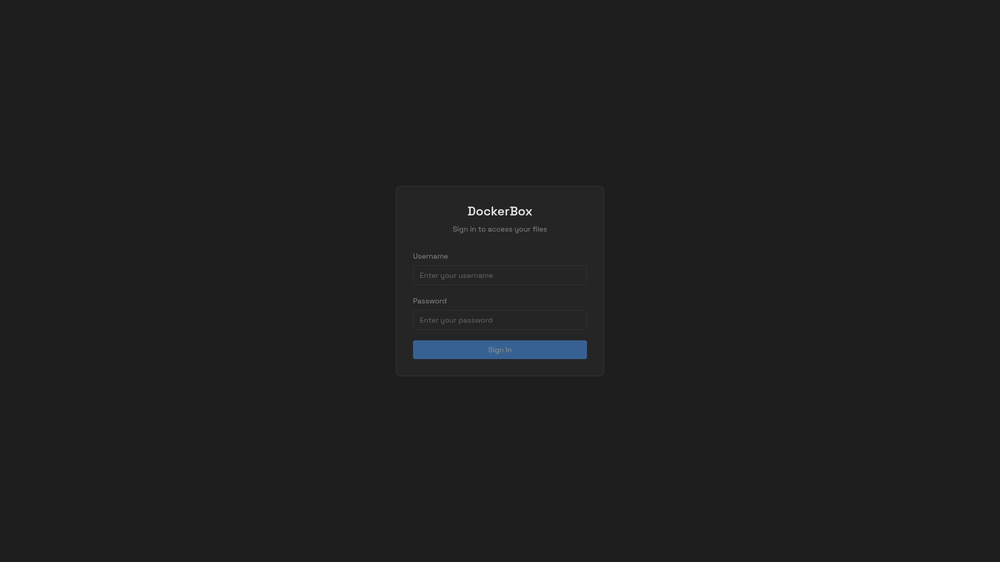
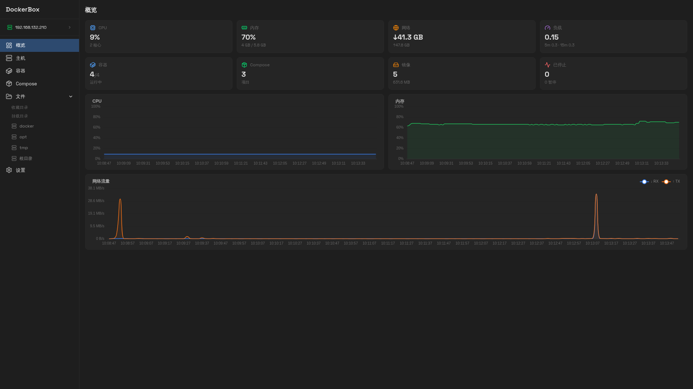
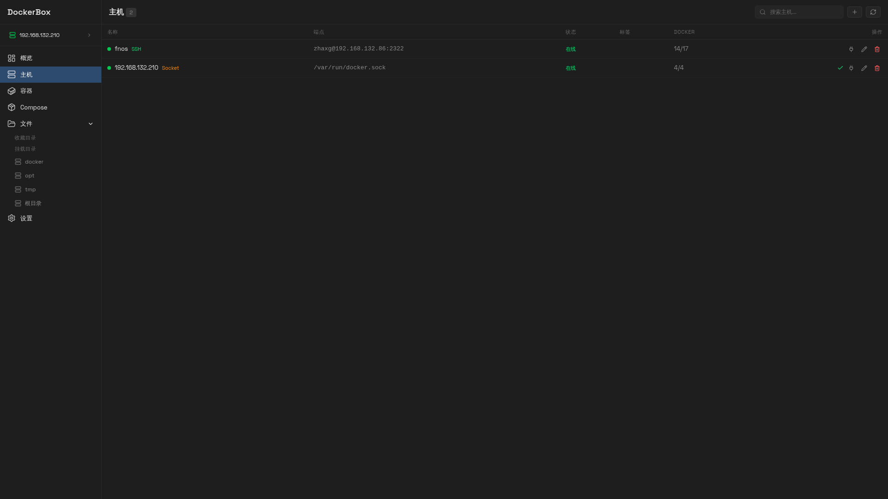
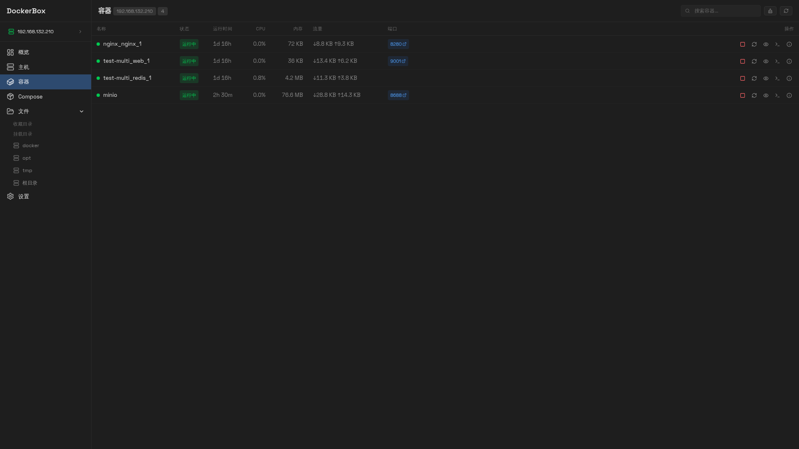
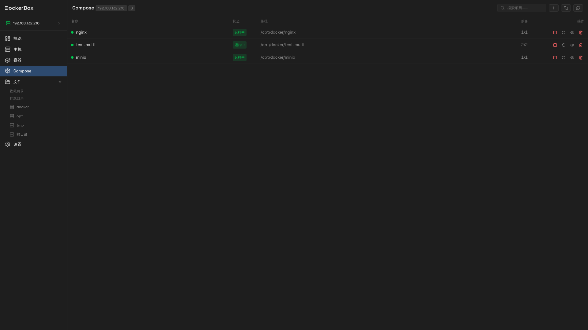
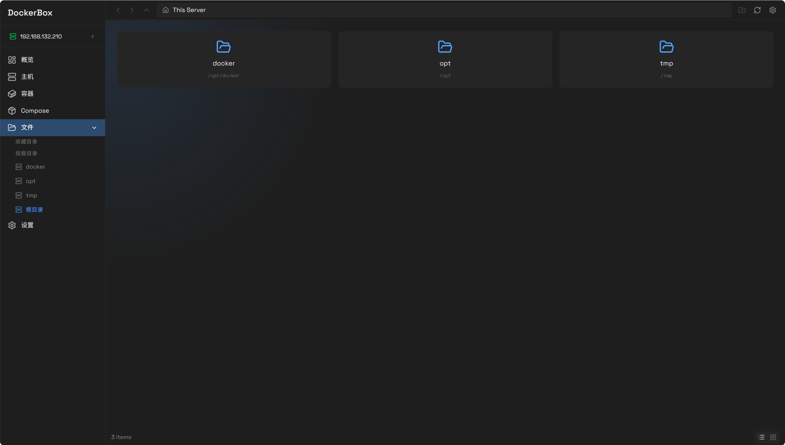
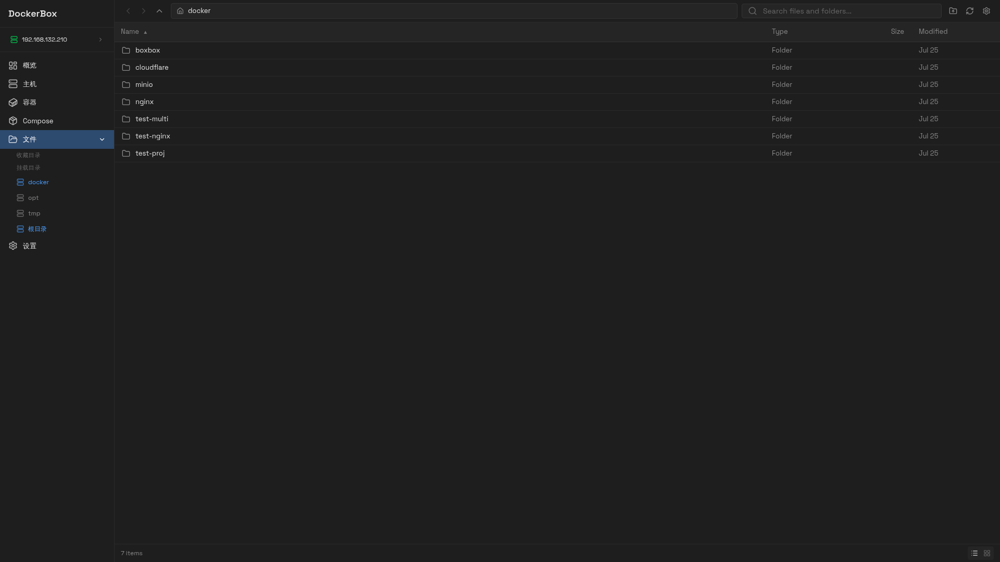
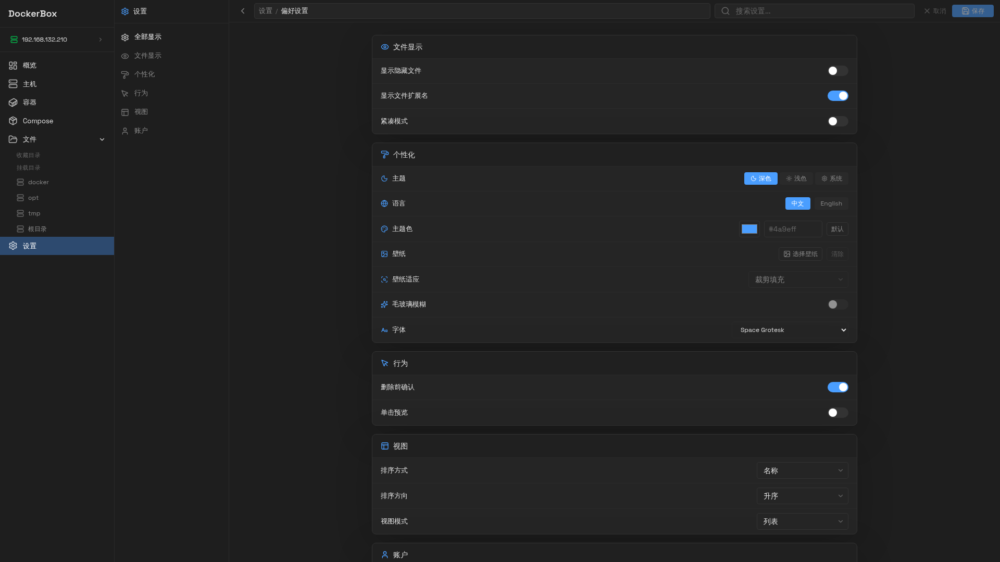

<h1 align="center">DockerBox</h1>

<p align="center">
  <strong>自托管的现代化文件管理与 Docker 管理平台</strong>
</p>

<p align="center">
  
  
  
  
  
</p>

DockerBox 是一个面向家庭服务器和 NAS 场景的自托管文件管理与 Docker 管理平台。提供现代化的浏览器界面，支持管理多台远程主机、Docker 容器、Compose 项目，以及跨挂载路径的文件操作。

感谢原作者 [jR4dh3y/BoxBox](https://github.com/jR4dh3y/BoxBox) 提供的基础骨架。

## 功能特性

- 🖥️ **多主机管理** — 通过 SSH 或 Socket 管理多台 Docker 主机
- 🐳 **Docker 控制** — 启动、停止、重启容器，进入终端，查看日志
- 📁 **文件浏览器** — 浏览、上传、下载、预览，支持拖拽操作
- 📝 **Compose 编辑器** — 内置 YAML 编辑器，支持语法高亮
- 🔒 **安全** — JWT 认证、基于角色的访问控制、只读挂载
- 🚀 **高性能** — Go 后端内嵌前端资源，WebSocket 实时推送
- 📱 **响应式** — 支持桌面和移动浏览器
- 🎨 **主题** — 深色/浅色模式、自定义强调色、壁纸支持
- 🌐 **多语言** — 支持中文、英文等多语言界面

## 截图

| | | | |
|---|---|---|---|
| <a href="screenshots/login.png"></a> | <a href="screenshots/overview.png"></a> | <a href="screenshots/hosts.png"></a> | <a href="screenshots/containers.png"></a> |
| <a href="screenshots/compose.png"></a> | <a href="screenshots/file-root.png"></a> | <a href="screenshots/file-docker.png"></a> | <a href="screenshots/settings.png"></a> |

## 快速开始

```bash
mkdir -p dockerbox && cd dockerbox

# 下载配置文件和 Compose 文件
curl -fsSLO https://raw.githubusercontent.com/zhaxg/dockerbox/master/docker-compose.yml
curl -fsSL https://raw.githubusercontent.com/zhaxg/dockerbox/master/backend/config.yaml -o config.yaml

# 编辑配置文件
$EDITOR config.yaml

# 启动
docker compose pull
docker compose up -d
```

打开 `http://localhost:8080`，使用 `config.yaml` 中配置的账号密码登录。

## 配置说明

启动容器前请先编辑 `config.yaml`：

```yaml
# 服务端
host: 0.0.0.0
port: 80

# 安全
jwt_secret: your-secret-here    # 生成命令: openssl rand -base64 32
rate_limit_rps: 10
allowed_origins: []
users:
    admin: your-password

# 上传
chunk_size_mb: 5
max_upload_mb: 10240

# Docker 主机
docker_hosts:
    default: local
    hosts:
        local:
            driver: socket
            endpoint: /var/run/docker.sock
            mount_points:
                docker:
                    path: /opt/docker
                    read_only: false
```

### Docker 主机

| 驱动 | 端点格式 | 说明 |
|------|----------|------|
| `socket` | `/var/run/docker.sock` | 本地 Docker Socket |
| `ssh` | `user@host:port` | 通过 SSH 连接远程主机 |

## 开发指南

### 环境要求

- Go 1.24+
- Bun
- Air（Go 热重载工具）

### 项目结构

```
backend/
├── bin/                # 本地开发运行时（已 gitignore）
│   ├── dockerbox       # 编译产物
│   ├── config.yaml     # 开发配置（端口 8081）
│   ├── data/           # 本地数据
│   └── logs/           # 本地日志
├── config.yaml         # 部署模板（端口 80）
└── internal/           # Go 源码

frontend/               # SvelteKit 应用
config.yaml             # Docker 部署配置
docker-compose.yml      # Docker 部署编排文件
```

### 启动服务

> **快速启动 — 一行命令：**
> ```bash
> # 先清理旧进程
> pkill -f 'air.*air.toml' 2>/dev/null; pkill -f 'dockerbox' 2>/dev/null
>
> # 后端（热重载，首次会自动创建 bin/config.yaml）
> cd backend && [ ! -f bin/config.yaml ] && cp config.yaml bin/config.yaml; export PATH="/root/go/bin:$PATH" && air -c .air.toml &
>
> # 前端（Vite 开发服务器）
> cd ../frontend && bun run dev
> ```

#### 第一步：后端

```bash
cd backend

# 首次开发：如果 bin/config.yaml 不存在，从模板复制一份，然后将端口改为 8081
[ ! -f bin/config.yaml ] && cp config.yaml bin/config.yaml

export PATH="/root/go/bin:$PATH"
air -c .air.toml
```

> **⚠️ 常见问题：**
>
> | 问题 | 原因 | 解决方法 |
> |------|------|----------|
> | `air: command not found` | air 安装在 `~/go/bin`，不在默认 PATH 中 | `export PATH="/root/go/bin:$PATH"` |
> | 端口 8081 被占用 | 有旧的后端进程残留 | `pkill -f dockerbox` 先清理 |

#### 第二步：前端

```bash
cd frontend
bun run dev
```

Vite 已配置代理，`/api` 和 `/ws` 请求会自动转发到后端 8081 端口。

#### 访问地址

| 服务 | 地址 |
|------|------|
| 前端（Vite 开发服务器） | `http://localhost:8080` |
| 后端（Go + air） | `http://localhost:8081` |

#### 配置文件关系

```
config.yaml              ← Docker 部署配置，端口 80（挂载到容器内，宿主机映射到 8080）

backend/
├── config.yaml          ← 后端部署模板，端口 80
├── bin/
│   └── config.yaml      ← 开发配置，端口 8081（air 运行时读取此文件）
└── .air.toml            ← full_bin 中 CONFIG_PATH=./bin/config.yaml
```

> **重要：** 开发时修改配置请编辑 `backend/bin/config.yaml`，不要改其他两个文件。

### 构建

```bash
# 二进制文件（本地开发）
cd frontend && bun run build
cd ../backend && go build -o bin/dockerbox .
```

> **注意：** Docker 镜像构建需要在支持 Docker 的环境中进行，本地开发时请使用上述二进制构建方式。


